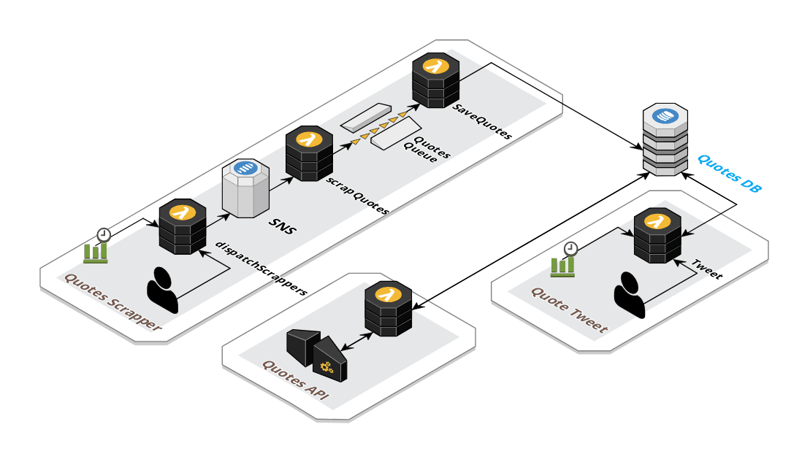
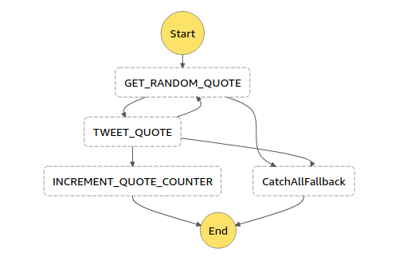

# Nietzsche

A [Serverless](https://serverless.com) application that fetches quotes from [Goodreads](https://www.goodreads.com/quotes) and saves it to [DynamoDB](https://aws.amazon.com/dynamodb). *(About 88K+ unique quotes)*

It also includes:

1) Quotes Search API
2) Tweet Quotes

## Architecture

### High Level Block Diagram

### Quote Tweet State Machine

## Requirements

1. [AWS CLI](https://docs.aws.amazon.com/cli/latest/userguide/cli-chap-install.html)
2. [Serverless](https://serverless.com)

## Setup

1. Get [Twitter API keys](https://developer.twitter.com/en/apps)
2. `aws ssm put-parameter --name nietzsche-twitter-consumer-secret --type String --value $CONSUMER_SECRET --profile default --overwrite --region eu-west-1`
3. `aws ssm put-parameter --name nietzsche-twitter-consumer-key --type String --value $CONSUMER_KEY --profile default --overwrite --region eu-west-1`
4. `aws ssm put-parameter --name nietzsche-twitter-access-token --type String --value $ACCESS_TOKEN --profile default --overwrite --region eu-west-1`
5. `aws ssm put-parameter --name nietzsche-twitter-access-token-secret --type String --value $ACCESS_TOKEN_SECRET --profile default --overwrite --region eu-west-1`
6. `npm i`

## Deploy

`npm run deploy`

## Invoke

### Start Quotes Scrapping Job

`serverless invoke -f dispatchScrappers --stage prod`

### Tweet Random Quote

`serverless invoke stepf --name tweetQuoteStateMachine --stage prod`

## Contribute

Help make this app better and future proof.

* Clone the code
* Install the dependencies with `npm install`
* Create a feature branch `git checkout -b new_feature`
* Lint with standard `npm run lint`

## License

This software is released under the MIT license. See [the license file](LICENSE) for more details.
